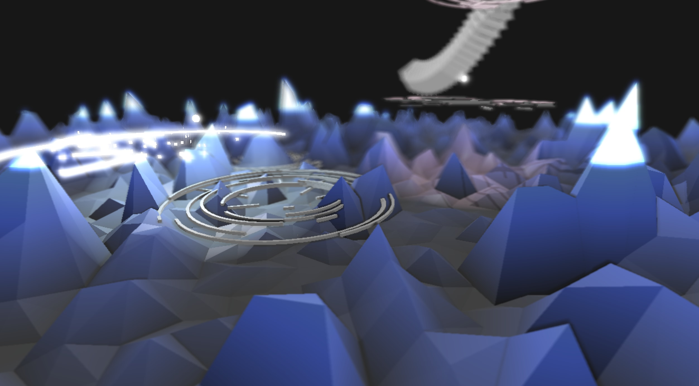

# Generative Nature VJ
This is a VJ set which was played in [Interim Report 2nd edtion](http://interim-report.org/edition2/).
It is based on an idea that the sound autonomously creates conceptual shapes / landscapes / natural environments.

## oF CG outputs

See also captured movies below.
* https://twitter.com/ayumu_naga/status/910671429196120069

### CG objects:
I reused objects I've made recently in [Daily Sketch repository](https://github.com/nama-gatsuo/DailySketch/) with minor modifications.

### VFX:

* Core 3D vfx like shading, lighting, HDR bloom, defocus blur are from [ofxDeferredShading](https://github.com/nama-gatsuo/ofxDeferredShading)
* Also it has post rendering process effects. Two kinds, the one is "warp" (vertical/horizontal mirror, complex plane transformation), and another is "Color conversion" (negative/positive grey scale, red scale, green scale).

## Max Controller

There are two section in the controller. The upper part is "bang section". The below part is "parameter sender section".
It will work by patching (connecting) two sections with cables.
VJ player can choose which bang will affect CG outputs.

### Bang section:
Bang section contains below.
* Attack Detection with band pass filter x 3
* Bpm Counter: sends bang in every 4 beats
* Key Detection: sends bang when space, a, s, d are pushed.
### Parameter sender section:
Sends values as OSC to simple address. Each address is corresponding OSC port of oF app.

# Author
[Ayumu Nagamatsu](http://ayumu-nagamatsu.com)

# License
[MIT License](./LICENSE.md)
